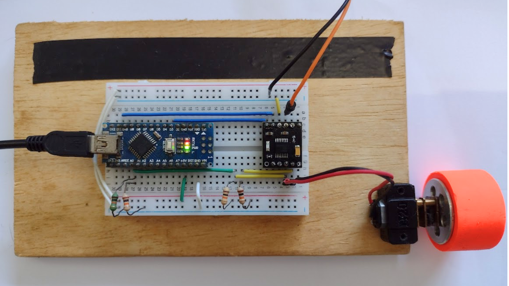
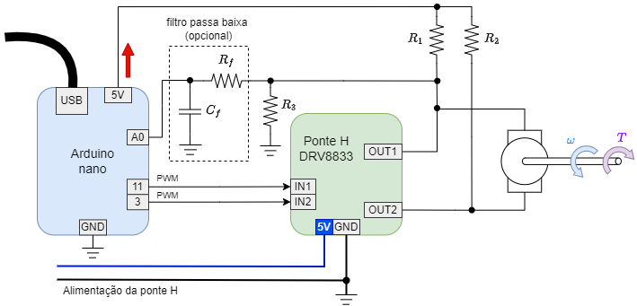
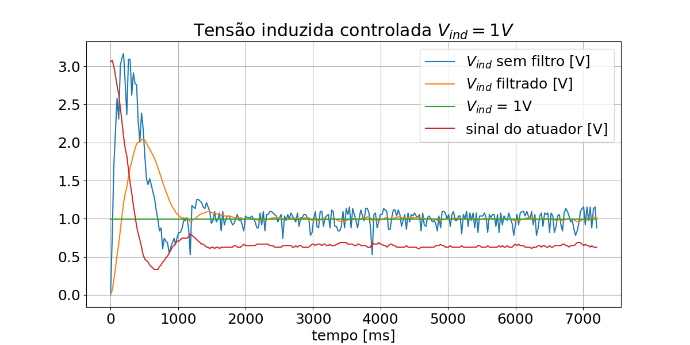
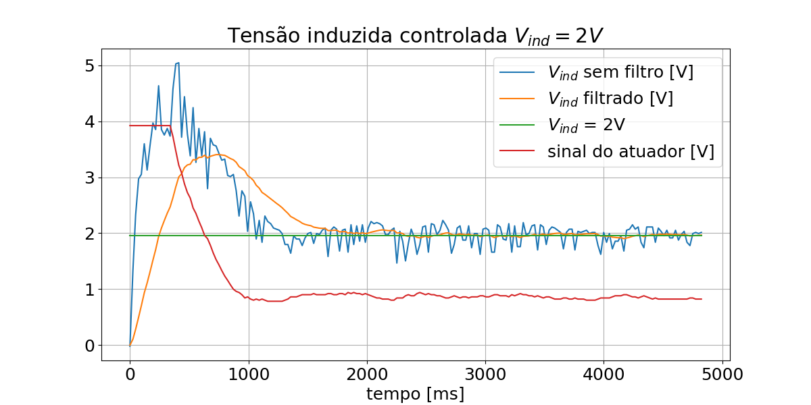
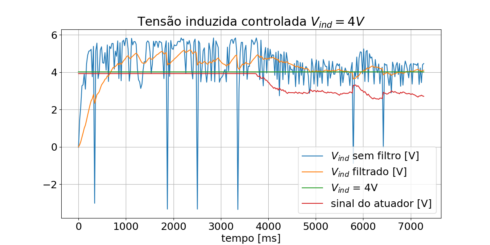
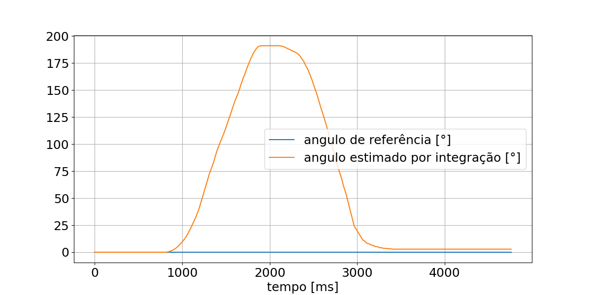
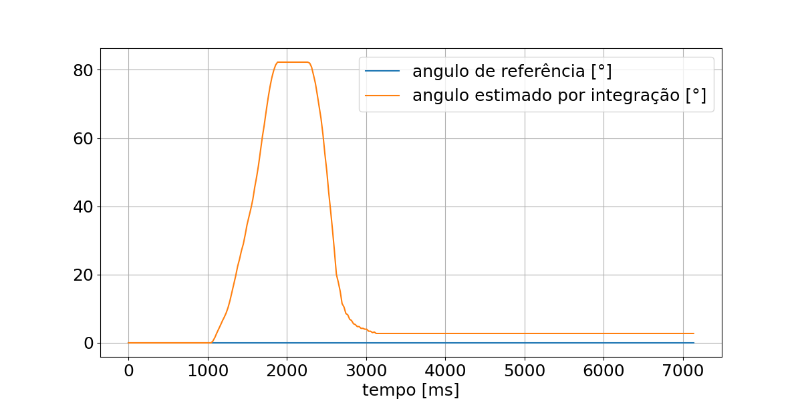
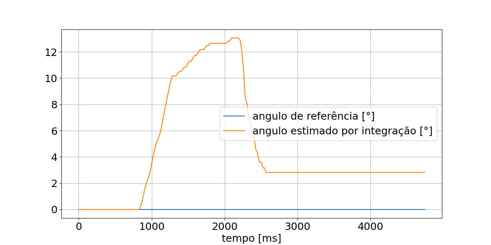

# sensorless_BCD_servo

Sistema de controle de velociade e posição de um motor escovado sem sensores.

# Metodologia

O controle sem uso de sensores é baseado na medição da tensão induzida quando o motor é desativado e na aplicação de um controlador PI para ajustar a velocidade de rotação do motor. O
Algorítimo para execução do procedimento é realizado utilizando uma placa de prototipagem de baixo custo baseada em Arduíno e pode ser resumido nas seguintes etapas:

- Desativa-se a ponte H, colocando a saída em alta impedância;
- Aguarda-se alguns milissegundos, para atenuar efeitos transitórios;
- Mede-se a tensão induzida;
- Filtra-se o sinal medido;
- Aplica-se o sinal de erro ao controlador PI obtendo-se o valor do sinal de controle;
- Aciona-se a ponte H, aplicando-se o sinal de controle;
- Aguarda-se alguns milissegundos e reinicia-se o procedimento.

## Montagem

## Resultados no modo de controle de velocidade

## Resultados no modo de controle de posição

